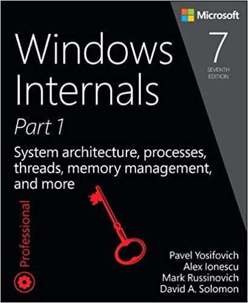

# Windows Internals

Author: Pavel Yosifovich  (Author), Mark Russinovich (Author), David Solomon (Author), Alex Ionescu  (Author)

## Overview

This book helps you:

- Understand the Windows system architecture and its general components
- Explore internal data structures using tools like the kernel debugger
- Understand how Windows uses processes for management and isolation
- Understand and view thread scheduling and how CPU resources are managed
- Dig into the Windows security model including recent advances in security mitigations
- Understand how Windows manages virtual and physical memory
- Understand how the I/O system manages physical devices and device drivers

The 7th edition was written by Pavel Yosifovich, Alex Ionescu, Mark Russinovich and David Solomon. New material has been added since the 6th edition (which covered Windows 7 and Windows Server 2008 R2). Since the 7th edition’s part 2 is not yet available, the Windows Internals 6th edition (written by Mark Russinovich, David Solomon and Alex Ionescu) is an invaluable resource on missing topics from the first part of the 7th edition. These include system mechanisms, management mechanisms, networking, file systems, cache management and troubleshooting system crashes.

## History of the Book

This is the seventh edition of a book that was originally called Inside Windows NT (Microsoft Press, 1992), written by Helen Custer (prior to the initial release of Microsoft Windows NT 3.1). Inside Windows NT was the first book ever published about Windows NT and provided key insights into the architecture and design of the system. Inside Windows NT, Second Edition (Microsoft Press, 1998) was written by David Solomon. It updated the original book to cover Windows NT 4.0 and had a greatly increased level of technical depth. Inside Windows 2000, Third Edition (Microsoft Press, 2000) was authored by David Solomon and Mark Russinovich. It added many new topics, such as startup and shutdown, service internals, registry internals, file-system drivers, and networking. It also covered kernel changes in Windows 2000, such as the Windows Driver Model (WDM), Plug and Play, power management, Windows Management Instrumentation (WMI), encryption, the job object, and Terminal Services. Windows Internals, Fourth Edition was the Windows XP and Windows Server 2003 update and added more content focused on helping IT professionals make use of their knowledge of Windows internals, such as using key tools from [Windows Sysinternals](https://docs.microsoft.com/en-us/sysinternals) and analyzing crash dumps.

Windows Internals, Fifth Edition was the update for Windows Vista and Windows Server 2008. It saw Mark Russinovich move on to a full-time job at Microsoft (where he is now the Azure CTO) and the addition of a new co-author, Alex Ionescu. New content included the image loader, user-mode debugging facility, Advanced Local Procedure Call (ALPC), and Hyper-V. The next release, Windows Internals, Sixth Edition, was fully updated to address the many kernel changes in Windows 7 and Windows Server 2008 R2, with many new hands-on experiments to reflect changes in the tools as well.

## Seventh Edition Changes

Since this series’ last update, Windows has gone through several releases, coming up to Windows 10 and Windows Server 2016. Windows 10 itself, being the current going-forward name for Windows, has had several releases since its initial Release-to-Manufacturing, or RTM, each labeled with a 4-digit version number indicating year and month of release, such as Windows 10, version 1703 that was completed in March 2017. The above implies that Windows has gone through at least 6 versions since Windows 7. Starting with Windows 8, Microsoft began a process of OS convergence, which is beneficial from a development perspective as well as for the Windows engineering team itself. Windows 8 and Windows Phone 8 had converged kernels, with modern app convergence arriving in Windows 8.1 and Windows Phone 8.1. The convergence story was complete with Windows 10, which runs on desktops/laptops, servers, XBOX One, phones (Windows Mobile 10), HoloLens, and various Internet of Things (IoT) devices. With this grand unification completed, the time was right for a new edition of the series, which could now finally catch up with almost half a decade of changes, in what will now be a more stabilized kernel architecture going forward. As such, this latest book covers aspects of Windows from Windows 8 to Windows 10, version 1703. Additionally, this edition welcomes Pavel Yosifovich as its new co-author.

## Cover

